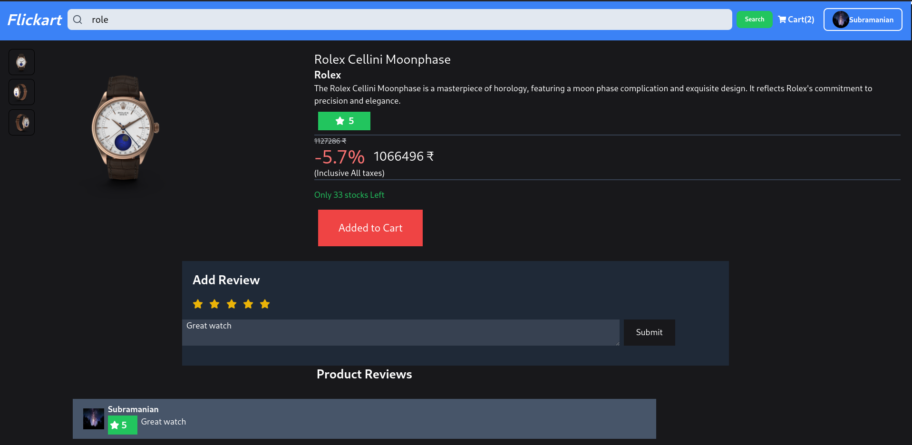
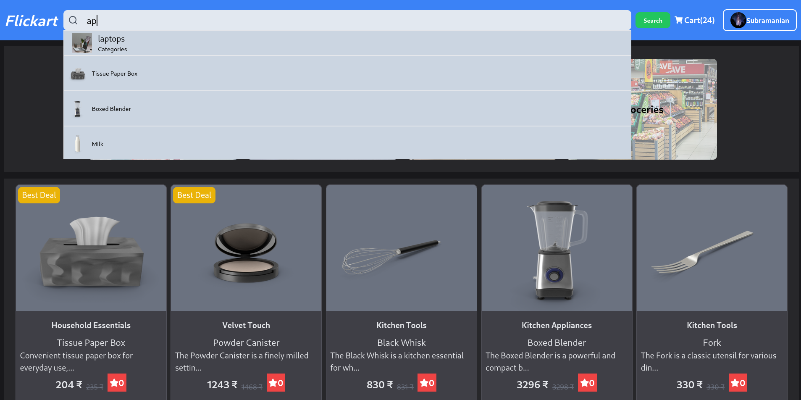
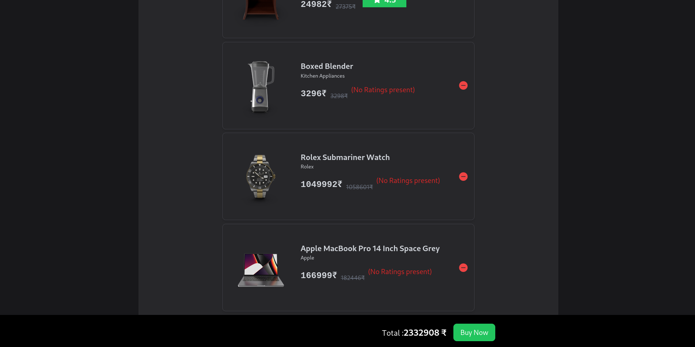

# Flickart - Frontend

 

## Description

The frontend of this eCommerce application is built with **React** and allows users to browse products, manage their cart, and submit reviews. The admin section provides controls for product management. The frontend is optimized using modern JavaScript techniques, including **lazy loading** and **infinite scrolling** for better performance and user experience.

## Key Features

- **Product Browsing**: View and search for products with infinite scrolling.
- **Cart Management**: Add products to the cart and update quantities.
- **Product Reviews**: Users can view and submit reviews for products.
- **Admin Features**: Admins can add, update, and delete products.
- **Optimizations**: Lazy loading for images and components for faster performance.

## UI images


1. product detailed view


2. Enhanced with search by categories products


3. Users Cart

## Frontend Setup

1. Navigate to the frontend folder.
2. Install dependencies:

    ```bash
    npm install
    ```

3. Start the React development server:

    ```bash
    npm start
    ```

## Frontend Optimizations

### Lazy Loading

Images and components are lazy-loaded to improve performance. Only images visible on the screen are loaded, reducing the initial load time.

### Infinite Scrolling

Infinite scrolling is implemented for the product listing page, allowing users to browse through large sets of products without a page refresh.

### API Requests

The frontend interacts with the backend using **Axios** for making API requests. It handles authentication by sending JWT tokens in the `Authorization` header for protected routes.

## Components Overview

### `ProductList`

- Displays a list of products with infinite scrolling.
- Fetches data from `/api/products`.

### `Cart`

- Displays the user's cart with the ability to update quantities.
- Uses `/api/cart` endpoints.

### `AdminPanel`

- Allows admins to add, update, and delete products.
- Uses `/api/products` endpoints for product management.

## Future Enhancements

- **Order Management**: Integrate order tracking and status updates for users.
- **Payment Integration**: Support for payment gateways.
