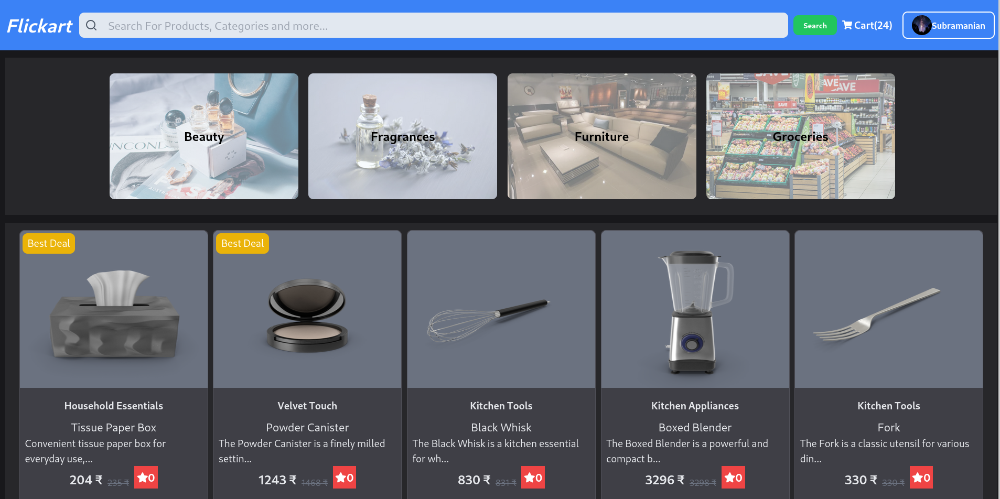

# Flickart

 

## Description

This is a fullstack eCommerce web application built with a **Servlet backend** and a **React frontend**. It allows users to browse products, add them to their cart, submit product reviews, and manage user profiles. Admins can manage products via an admin panel. The frontend is optimized with modern web techniques like infinite scrolling and lazy loading, while the backend ensures secure authentication using JWT.

The project is divided into two main components:
- **Backend**: Handles server-side logic, database management, and API routes.
- **Frontend**: Provides a user-friendly interface for browsing and interacting with the application.

For more detailed information, please refer to the [Backend README](./flickart/README.md) and [Frontend README](./FlickartApp/README.md).

## Key Features

- **User Authentication**: JWT-based login and registration.
- **Product Management**: Users can browse, review, and purchase products.
- **Admin Controls**: Admins can add, edit, and delete products.
- **Performance Optimizations**: Frontend optimized with lazy loading and infinite scrolling.

## Technology Stack

- **Frontend**: React, Axios
- **Backend**: Java Servlets, MySQL, JWT for authentication, Gson for JSON serialization
- **Database**: MySQL

For installation instructions and further details, please visit the specific component READMEs:
- [Backend README](./backend/README.md)
- [Frontend README](./frontend/README.md)
